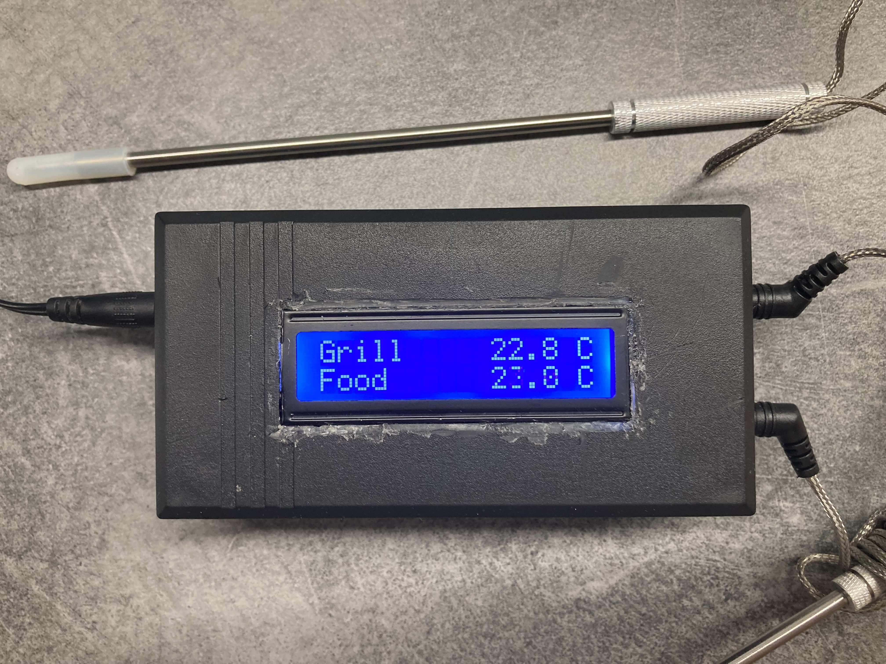

# BBQ/Food Thermometer

The goal is to monitor cooking temperatures in grill or oven on a screen and stream data to server for further processing (notifications, charts).

## Features

* Temperature display on LCD screen.
* Temperature streaming to server via MQTT protocol.

## Folder Structure

| Path    | Description                       |
|---------|-----------------------------------|
| assets/ | Assets for documentation.         |
| code/   | Code for ESP8266 and Arduino UNO. |

## Parts

* Breadboard (testing only)
* Power Supply
* Case
* Arduino UNO
* ESP8266-01S
* LCD display (16x2)
* 2x Mono jacks (2.5mm)
* 2x Food probes
* Potentiometer
* Wires

## How it works

1. Arduino reads food grade thermistor sensor data.
2. Arduino then calculates temperature from analog data input.
3. Arduino displays data on LCD display.
4. Arduino writes data values to a serial port.
5. ESP8266 reads data from serial port.
6. ESP8266 publishes data to a MQTT server.
7. Wait for 10 seconds.
8. Rinse & repeat.

## Wiring

* ESP8266 is connected to serial port of Arduino uno and 3v3 power output.
* Food thermistor probes connected to Arduino uno analog inputs.
* LCD screen connected to Arduino uno digital pins and power 5v output.
* Potentiometer is connected to LCD to control brightness. 

## Finished Prototype

This is how it looks finished prototype.

